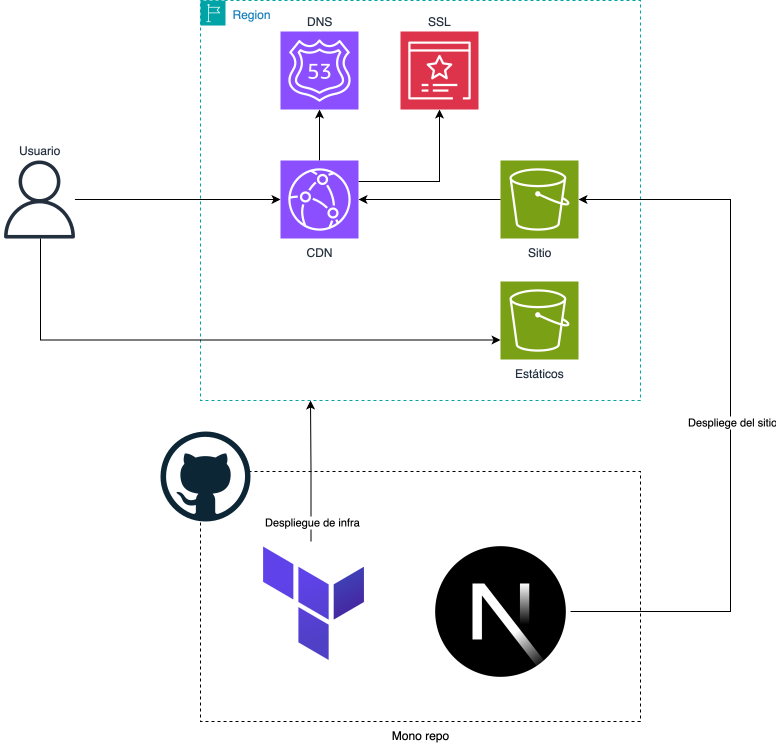

# Arquitectura
Todo el sitio está hospedado en [AWS](https://aws.amazon.com/es/) (Amazon Web Services) un provedor de servicios en la nube con costos eficientes bajo demanda y un sin fin de servicios que son escalables y distribuidos.

La arquitectura incluye los siguientes servicios
- **S3** (Simple Storage Service) se usa para almacenar tanto los archivos estáticos compilados como las imágenes
  - `seyva-static-site` cubeta donde se hospedan los ficheros del sitio
  - `seyva-media-assets` cubeta donde se hospedan la imágenes y otros estáticos de tamaño moderado
- **Cloud Front** es un servicio de CDN. Se usa para almacenar los archivos estáticos en ubicaciones más cercanas a los usuarios, resultando en mejores tiempos de carga.
- **Route53** es un servicio de DNS. Se usa para gestionar las direcciones como `seyva.mx` o `wwww.seyva.mx`.
- **ACM** (AWS Certificate Manager) se usa para proveer una conexión encriptada entre el usuario y el servidor. Es un componente clave para evitar ataques y filtraciones de información.
- **IAM** es el servicio de identidad y acceso integrado de AWS, es usado para mantener la infraestructura segura y que cada componente tenga exclusivamente los permisos que requiere.

