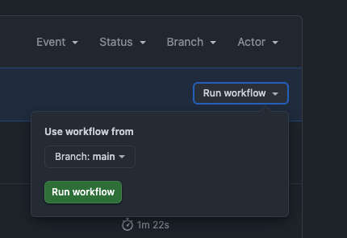
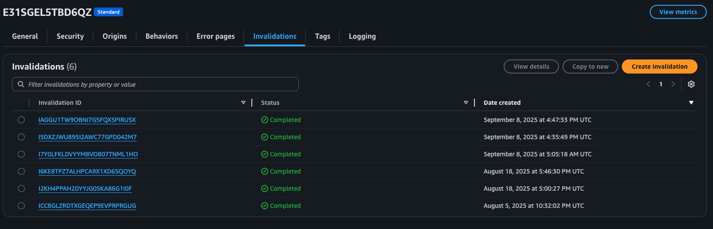
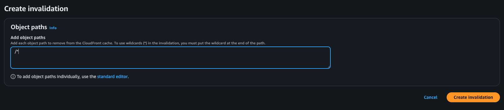
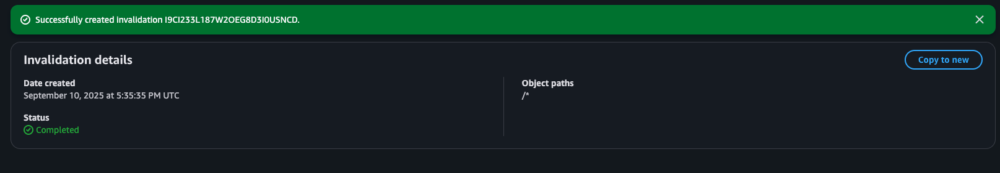

# Procedimientos
Hay procedimiento que se ejecutarán de manera regular y no están 100% automatizados por su naturaleza.

## Despliegue
Para desplegar con GitHub Actions
1. Ir a la pestaña de Actions en el repositorio de GitHub.
2. Seleccionar `Deploy static files to site` o ir [aquí](https://github.com/gerisai/seyva/actions/workflows/deploy-site.yml).
3. Clickar en `Run workflow`
4. Clickar en el botón verde `Run workflow`

## Limpiar cache de CloudFront
1. Iniciar sesión en AWS
2. Ir al servicio de CloudFront
3. Seleccionar la distribución del sitio (`E31SGEL5TBD6QZ`)
4. Ir al pestaña de `Invalidations`
5. Seleccionar `Create invalidation`

6. Introducir el patrón `/*` y `Create invalidation`

7. Esperar a que termine
